This guide provides a comprehensive overview of HeadElf's technical architecture, design principles, and implementation patterns.

## System Overview

HeadElf implements a sophisticated three-dimensional extensibility framework that scales horizontally across C-suite functions, vertically across industry contexts, and organizationally across enterprise-specific patterns.

## 🏗️ HeadElf Architecture Diagram

<div class="architecture-diagram">
  <div class="diagram-container">

    <!-- Core Executive Intelligence Engine -->
    <div class="core-engine">
      <h4>🧠 Executive Intelligence Core Engine</h4>
      <p>Cross-functional decision orchestration</p>
    </div>

    <!-- Horizontal C-Suite Layer -->
    <div class="horizontal-layer">
      <h3>🔄 Horizontal C-Suite Architecture</h3>
      <div class="csuite-modules">
        <div class="csuite-module cto">CTO</div>
        <div class="csuite-module cio">CIO</div>
        <div class="csuite-module ciso">CISO</div>
        <div class="csuite-module cfo">CFO</div>
        <div class="csuite-module coo">COO</div>
        <div class="csuite-module clo">CLO</div>
        <div class="csuite-module chro">CHRO</div>
        <div class="csuite-module cmso">CMSO</div>
        <div class="csuite-module cpo">CPO</div>
      </div>
      <div class="horizontal-description">
        <strong>9 C-Suite Executive Intelligence Modules</strong><br>
        Autonomous decision-making across all executive functions
      </div>
    </div>

    <!-- Comprehensive Security Intelligence Layer -->
    <div class="security-layer">
      <h3>🛡️ Comprehensive Security Intelligence Framework</h3>

      <!-- Executive Security Leadership -->
      <div class="security-tier executive-security">
        <h4>Executive Security Leadership (3 Roles)</h4>
        <div class="security-modules">
          <div class="security-module cso">CSO</div>
          <div class="security-module cpo-privacy">CPO Privacy</div>
          <div class="security-module cro">CRO</div>
        </div>
      </div>

      <!-- Operational Security Leadership -->
      <div class="security-tier operational-security">
        <h4>Operational Security Leadership (5 Roles)</h4>
        <div class="security-modules">
          <div class="security-module soc">SOC Director</div>
          <div class="security-module iam">IAM Director</div>
          <div class="security-module arch">Sec Arch Director</div>
          <div class="security-module threat">Threat Intel Director</div>
          <div class="security-module vuln">Vuln Mgmt Director</div>
        </div>
      </div>

      <!-- Compliance & Governance Security -->
      <div class="security-tier compliance-security">
        <h4>Compliance & Governance Security (4 Roles)</h4>
        <div class="security-modules">
          <div class="security-module grc">GRC Director</div>
          <div class="security-module compliance">Compliance Director</div>
          <div class="security-module audit">Audit Director</div>
          <div class="security-module privacy">Privacy Director</div>
        </div>
      </div>

      <!-- Specialized Technical Security -->
      <div class="security-tier specialized-security">
        <h4>Specialized Technical Security (4 Roles)</h4>
        <div class="security-modules">
          <div class="security-module forensic">Forensic Director</div>
          <div class="security-module incident">IR Director</div>
          <div class="security-module research">Research Director</div>
          <div class="security-module continuity">BCP Director</div>
        </div>
      </div>

      <div class="security-description">
        <strong>16 Specialized Security Leadership Modules</strong><br>
        Comprehensive security intelligence across all critical domains
      </div>
    </div>

    <!-- Vertical Industry Layer -->
    <div class="vertical-layer">
      <h3>📊 Vertical Industry Extensions</h3>
      <div class="industry-extensions">
        <div class="industry-ext financial">Financial Services</div>
        <div class="industry-ext healthcare">Healthcare</div>
        <div class="industry-ext manufacturing">Manufacturing</div>
        <div class="industry-ext technology">Technology</div>
        <div class="industry-ext energy">Energy</div>
        <div class="industry-ext aerospace">Aerospace</div>
        <div class="industry-ext retail">Retail</div>
        <div class="industry-ext telecom">Telecom</div>
        <div class="industry-ext education">Education</div>
        <div class="industry-ext government">Government</div>
      </div>
      <div class="vertical-description">
        <strong>10+ Industry Vertical Extensions</strong><br>
        Regulatory compliance and domain-specific expertise
      </div>
    </div>

    <!-- Enterprise Context Layer -->
    <div class="enterprise-layer">
      <h3>🏢 Enterprise Context Adaptation</h3>
      <div class="enterprise-contexts">
        <div class="enterprise-ctx startup">Startup</div>
        <div class="enterprise-ctx growth">Growth Stage</div>
        <div class="enterprise-ctx enterprise">Enterprise</div>
        <div class="enterprise-ctx multinational">Multinational</div>
        <div class="enterprise-ctx public">Public Company</div>
        <div class="enterprise-ctx private-equity">Private Equity</div>
        <div class="enterprise-ctx family-office">Family Office</div>
      </div>
      <div class="enterprise-description">
        <strong>7 Enterprise Context Types</strong><br>
        Anonymized organizational patterns and cultural frameworks
      </div>
    </div>

    <!-- Integration Arrows -->
    <div class="integration-arrows">
      <div class="arrow horizontal-arrow">⟷</div>
      <div class="arrow vertical-arrow">⟷</div>
      <div class="arrow enterprise-arrow">⟷</div>
    </div>

  </div>

  <!-- Architecture Legend -->
  <div class="architecture-legend">
    <h4>🔧 Three-Dimensional Extensibility Framework</h4>
    <div class="legend-items">
      <div class="legend-item">
        <span class="legend-color horizontal-color"></span>
        <strong>Horizontal:</strong> C-Suite role expansion and specialization
      </div>
      <div class="legend-item">
        <span class="legend-color vertical-color"></span>
        <strong>Vertical:</strong> Industry-specific regulatory and operational expertise
      </div>
      <div class="legend-item">
        <span class="legend-color enterprise-color"></span>
        <strong>Enterprise:</strong> Company-specific organizational patterns and contexts
      </div>
    </div>
  </div>

</div>

### Detailed Architecture Flow

```mermaid
graph TB
    %% Core Engine
    Core[🧠 Executive Intelligence Core Engine<br/>Cross-functional Decision Orchestration]

    %% Horizontal C-Suite Layer
    subgraph Horizontal [🔄 Horizontal C-Suite Architecture]
        CTO[🚀 CTO Intelligence<br/>Technology Strategy<br/>Venture Capital<br/>Innovation Management]
        CIO[💼 CIO Intelligence<br/>Digital Transformation<br/>IT Operations<br/>Enterprise Architecture]
        CISO[🛡️ CISO Intelligence<br/>Global Compliance<br/>Zero Trust Security<br/>Crisis Management]
        CFO[💰 CFO Intelligence<br/>Capital Markets<br/>M&A Execution<br/>Financial Strategy]
        COO[⚙️ COO Intelligence<br/>Operational Excellence<br/>Supply Chain<br/>Performance Management]
        CLO[⚖️ CLO Intelligence<br/>Legal Strategy<br/>Contract Excellence<br/>IP Management]
        CHRO[👥 CHRO Intelligence<br/>Talent Strategy<br/>Culture Leadership<br/>Performance Systems]
        CMSO[📈 CMSO Intelligence<br/>Marketing Excellence<br/>Sales Operations<br/>Customer Strategy]
        CPO[🎯 CPO Intelligence<br/>Product Strategy<br/>User Experience<br/>Innovation Management]
    end

    %% Vertical Industry Layer
    subgraph Vertical [📊 Vertical Industry Extensions]
        FinServ[🏦 Financial Services<br/>Basel III, Dodd-Frank<br/>MiFID II Compliance]
        Healthcare[🏥 Healthcare<br/>FDA, HIPAA<br/>Clinical Operations]
        Manufacturing[🏭 Manufacturing<br/>Industry 4.0<br/>Supply Chain]
        Technology[💻 Technology<br/>SOC 2, GDPR<br/>Innovation Frameworks]
        Energy[⚡ Energy & Utilities<br/>NERC, EPA<br/>Renewable Integration]
        More[... 5+ More Industries]
    end

    %% Enterprise Context Layer
    subgraph Enterprise [🏢 Enterprise Context Adaptation]
        Startup[🚀 Startup Context<br/>Resource Optimization<br/>Rapid Decision-Making]
        Growth[📈 Growth Stage<br/>Scaling Operations<br/>Investor Relations]
        EnterpriseCorp[🏢 Enterprise<br/>Complex Stakeholders<br/>Global Coordination]
        Multinational[🌍 Multinational<br/>Cultural Adaptation<br/>Jurisdictional Compliance]
        PublicCo[📊 Public Company<br/>SEC Compliance<br/>Governance Excellence]
        MoreCtx[... 2+ More Contexts]
    end

    %% Core Connections
    Core --> Horizontal
    Core --> Vertical
    Core --> Enterprise

    %% Cross-dimensional Integration
    Horizontal -.->|Enhanced by| Vertical
    Horizontal -.->|Adapted for| Enterprise
    Vertical -.->|Contextualized by| Enterprise

    %% Example Integration Flow
    CTO -.->|Enhanced by| Technology
    Technology -.->|Contextualized for| Startup

    CFO -.->|Enhanced by| FinServ
    FinServ -.->|Contextualized for| PublicCo

    style Core fill:#667eea,stroke:#333,stroke-width:3px,color:#fff
    style Horizontal fill:#e3f2fd,stroke:#1976d2,stroke-width:2px
    style Vertical fill:#f3e5f5,stroke:#7b1fa2,stroke-width:2px
    style Enterprise fill:#e8f5e8,stroke:#388e3c,stroke-width:2px
```



### Core Architecture Principles

**1. Executive Intelligence First**
- All components designed for autonomous executive decision-making
- Cross-functional coordination built into the core architecture
- Authority-based decision routing with escalation management

**2. Three-Dimensional Extensibility**
- Horizontal scaling: C-suite role expansion and specialization
- Vertical scaling: Industry verticals with regulatory compliance
- Enterprise scaling: Company-specific organizational patterns and contexts
- Community-driven extension ecosystem with quality validation

**3. Enterprise-Grade Security and Privacy**
- Multi-level anonymization for enterprise contributions
- Privacy-preserving decision-making with data minimization
- Comprehensive audit trails and compliance monitoring

**4. Global Operations Excellence**
- 24/7 follow-the-sun operations with cultural adaptation
- Real-time enterprise system integration
- Autonomous decision-making with human oversight

## Core Components

### Executive Intelligence Core Engine

The central orchestration engine coordinates all C-suite functions:

```typescript
interface ExecutiveIntelligenceEngine {
  // Core decision orchestration
  coordinateDecision(context: ExecutiveContext): Promise<CoordinatedDecision>

  // Cross-functional analysis
  analyzeCrossFunctional(scenario: BusinessScenario): Promise<MultiDimensionalAnalysis>

  // Authority and escalation management
  routeDecision(decision: ExecutiveDecision): Promise<DecisionRouting>

  // Global operations coordination
  coordinateGlobalOperations(context: GlobalContext): Promise<OperationalCoordination>
}
```

**Key Responsibilities:**
- Cross-functional decision coordination across all C-suite roles
- Authority-based routing with 5-level escalation matrix
- Global context adaptation and cultural localization
- Performance monitoring and continuous improvement

### C-Suite Intelligence Modules

Each C-suite role is implemented as a specialized intelligence module:

#### CTO Intelligence Module
```typescript
interface CTOIntelligence {
  // Technology strategy and architecture
  evaluateTechnologyStack(): Promise<TechnologyAssessment>
  designArchitectureRoadmap(): Promise<ArchitectureRoadmap>

  // Innovation and R&D
  evaluateInnovationOpportunities(): Promise<InnovationPortfolio>
  manageIPStrategy(): Promise<IntellectualPropertyStrategy>

  // Venture capital and M&A
  evaluateStartupInvestment(): Promise<InvestmentEvaluation>
  assessTechnologyIntegration(): Promise<IntegrationAssessment>
}
```

#### CFO Intelligence Module
```typescript
interface CFOIntelligence {
  // Financial strategy and planning
  developFinancialStrategy(): Promise<FinancialStrategy>
  performScenarioModeling(): Promise<FinancialScenarios>

  // Capital markets and M&A
  structureMandADeal(): Promise<DealStructure>
  manageInvestorRelations(): Promise<InvestorStrategy>

  // Treasury and risk management
  optimizeCapitalStructure(): Promise<CapitalOptimization>
  assessFinancialRisk(): Promise<RiskAssessment>
}
```

#### CISO Intelligence Module
```typescript
interface CISOIntelligence {
  // Security governance and compliance
  assessSecurityPosture(): Promise<SecurityAssessment>
  ensureRegulatoryCompliance(): Promise<ComplianceStatus>

  // Crisis management and incident response
  coordinateCrisisResponse(): Promise<CrisisResponsePlan>
  manageIncidentResponse(): Promise<IncidentResponseExecution>

  // Zero trust and quantum readiness
  implementZeroTrust(): Promise<ZeroTrustImplementation>
  prepareQuantumCryptography(): Promise<QuantumReadinessAssessment>
}
```

#### CIO Intelligence Module
```typescript
interface CIOIntelligence {
  // Digital transformation leadership
  leadDigitalTransformation(): Promise<TransformationRoadmap>
  implementEnterpriseArchitecture(): Promise<ArchitectureImplementation>

  // IT operations excellence
  optimizeITOperations(): Promise<OperationalOptimization>
  manageApplicationPortfolio(): Promise<ApplicationStrategy>

  // Business-IT alignment
  alignBusinessIT(): Promise<AlignmentStrategy>
  manageStakeholderRelations(): Promise<StakeholderEngagement>
}
```

#### COO Intelligence Module
```typescript
interface COOIntelligence {
  // Operational excellence
  implementOperationalExcellence(): Promise<OperationalStrategy>
  optimizeBusinessProcesses(): Promise<ProcessOptimization>

  // Supply chain and vendor management
  optimizeSupplyChain(): Promise<SupplyChainStrategy>
  manageVendorRelationships(): Promise<VendorStrategy>

  // Performance and organizational development
  optimizePerformance(): Promise<PerformanceStrategy>
  developOrganization(): Promise<OrganizationalDevelopment>
}
```

## Three-Dimensional Extensibility Framework

### Industry Vertical Extensions

Industry extensions provide domain-specific expertise and regulatory compliance:

```typescript
interface IndustryExtension {
  industry: IndustryType
  regulatoryFrameworks: RegulatoryFramework[]
  domainExpertise: DomainCapability[]

  enhanceExecutiveDecision(
    decision: ExecutiveDecision,
    context: IndustryContext
  ): Promise<EnhancedDecision>

  validateCompliance(
    decision: ExecutiveDecision,
    regulations: RegulatoryFramework[]
  ): Promise<ComplianceValidation>
}
```

**Supported Industry Verticals:**
- Financial Services (Basel III, Dodd-Frank, MiFID II)
- Healthcare & Life Sciences (FDA, HIPAA, GCP)
- Manufacturing & Industrial (ISO 9001, Industry 4.0)
- Technology & Software (SOC 2, ISO 27001, GDPR)
- Energy & Utilities (NERC, EPA, renewable energy)
- Aerospace & Defense (ITAR, FAR, AS9100)
- Retail & Consumer Goods (PCI DSS, consumer protection)
- Telecommunications (FCC, spectrum management)
- Education (FERPA, accreditation standards)
- Government & Public Sector (federal compliance, procurement)

### Enterprise Context Extensions

Enterprise context extensions adapt decision-making to organizational patterns:

```typescript
interface EnterpriseContextExtension {
  contextType: EnterpriseContextType
  organizationalPatterns: AnonymizedPattern[]
  culturalFrameworks: CulturalAdaptation[]

  adaptDecisionContext(
    decision: ExecutiveDecision,
    context: EnterpriseContext
  ): Promise<ContextualizedDecision>

  matchOrganizationalPatterns(
    currentContext: ExecutiveContext
  ): Promise<PatternMatchResult>
}
```

**Supported Enterprise Contexts:**
- Startup & Early Stage (resource optimization, rapid decisions)
- Growth Stage Companies (scaling operations, investor relations)
- Large Enterprise (complex stakeholders, global coordination)
- Multinational Corporations (cultural adaptation, jurisdictional compliance)
- Public Companies (SEC compliance, governance, transparency)
- Private Equity Portfolio (operational excellence, value creation)
- Family Office Operations (wealth management, legacy planning)

## Advanced Components

### AI/ML Executive Reasoning Engine

Advanced artificial intelligence capabilities for executive decision-making:

```typescript
interface ExecutiveReasoningEngine {
  // Contextual reasoning
  performContextualAnalysis(context: ExecutiveContext): Promise<ContextualInsights>

  // Strategic reasoning
  developStrategicRecommendations(scenario: BusinessScenario): Promise<StrategicRecommendations>

  // Ethical reasoning
  assessEthicalImplications(decision: ExecutiveDecision): Promise<EthicalAssessment>

  // Predictive analytics
  forecastBusinessOutcomes(decisions: ExecutiveDecision[]): Promise<OutcomeForecasts>
}
```

**Key Capabilities:**
- Multi-objective optimization for complex decisions
- Reinforcement learning from decision outcomes
- Natural language processing for executive communication
- Ensemble modeling for robust recommendations

### Enterprise Integration Platform

Real-time connectivity with enterprise systems:

```typescript
interface EnterpriseIntegrationPlatform {
  // ERP integration
  connectERP(credentials: ERPCredentials): Promise<ERPConnection>
  syncERPData(): Promise<ERPDataSync>

  // CRM integration
  connectCRM(credentials: CRMCredentials): Promise<CRMConnection>
  analyzeCRMTrends(): Promise<CRMAnalytics>

  // Financial system integration
  connectFinancialSystems(credentials: FinancialCredentials): Promise<FinancialConnection>
  retrieveFinancialData(): Promise<FinancialData>

  // HRIS integration
  connectHRIS(credentials: HRISCredentials): Promise<HRISConnection>
  analyzeWorkforceMetrics(): Promise<WorkforceAnalytics>
}
```

### Global Operations Platform

24/7 global operations with cultural and regulatory adaptation:

```typescript
interface GlobalOperationsPlatform {
  // Follow-the-sun operations
  coordinateGlobalHandoffs(): Promise<GlobalHandoffCoordination>
  adaptCulturalContext(region: GlobalRegion): Promise<CulturalAdaptation>

  // Regulatory localization
  localizeRegulatory(jurisdiction: Jurisdiction): Promise<RegulatoryLocalization>
  ensureMultiJurisdictionalCompliance(): Promise<GlobalComplianceStatus>

  // Crisis coordination
  coordinateGlobalCrisis(crisis: GlobalCrisis): Promise<GlobalCrisisResponse>
  manageStakeholderCommunication(): Promise<StakeholderCommunication>
}
```

## Data Architecture

### Executive Data Model

HeadElf uses a comprehensive data model for executive intelligence:

```typescript
interface ExecutiveDataModel {
  // Business context
  businessContext: BusinessContext
  organizationalContext: OrganizationalContext
  strategicContext: StrategicContext

  // Decision framework
  authorityMatrix: AuthorityMatrix
  escalationPaths: EscalationPath[]
  complianceRequirements: ComplianceRequirement[]

  // Performance metrics
  kpiFramework: KPIFramework
  performanceBaselines: PerformanceBaseline[]
  benchmarkData: BenchmarkData
}
```

### Privacy and Anonymization

Multi-level anonymization ensures enterprise privacy:

```typescript
interface AnonymizationEngine {
  anonymizationLevels: AnonymizationLevel[]

  anonymize(
    data: EnterpriseData,
    level: AnonymizationLevel
  ): Promise<AnonymizedData>

  validatePrivacyCompliance(
    data: AnonymizedData,
    standards: PrivacyStandard[]
  ): Promise<PrivacyComplianceResult>
}
```

**Anonymization Levels:**
- **Basic**: Remove direct identifiers, preserve operational patterns
- **Enhanced**: Statistical anonymization with differential privacy
- **Advanced**: K-anonymity and l-diversity for sensitive data
- **Maximum**: Full anonymization with synthetic data generation

## Performance Architecture

### Scalability Design

HeadElf is designed for enterprise-scale operations:

**Horizontal Scaling:**
- Microservices architecture with independent C-suite modules
- Event-driven architecture with message queuing
- Distributed caching for global operations
- Load balancing across multiple regions

**Vertical Scaling:**
- Memory-efficient algorithms for large-scale analysis
- GPU acceleration for AI/ML workloads
- Optimized data structures for real-time processing
- Compression and archival for historical data

### Performance Monitoring

Comprehensive performance monitoring and optimization:

```typescript
interface PerformanceMonitor {
  // Real-time metrics
  collectRealTimeMetrics(): Promise<RealTimeMetrics>

  // Performance baselines
  establishBaselines(): Promise<PerformanceBaseline>

  // Optimization recommendations
  generateOptimizationRecommendations(): Promise<OptimizationRecommendations>

  // Business impact analysis
  analyzeBusiness Impact(): Promise<BusinessImpactAnalysis>
}
```

## Security Architecture

### Comprehensive Security Framework

Enterprise-grade security across all components:

**Authentication & Authorization:**
- Multi-factor authentication with hardware tokens
- Role-based access control with fine-grained permissions
- OAuth 2.0 and SAML integration for enterprise SSO
- API key management with automatic rotation

**Data Protection:**
- AES-256 encryption for data at rest
- TLS 1.3 for data in transit
- End-to-end encryption for sensitive communications
- Hardware security modules for key management

**Compliance & Audit:**
- Comprehensive audit logging with tamper protection
- Real-time compliance monitoring and alerting
- Regular security assessments and penetration testing
- Incident response and breach notification procedures

## Deployment Architecture

### Container-Based Deployment

HeadElf uses modern container orchestration:

```yaml
apiVersion: apps/v1
kind: Deployment
metadata:
  name: headelf-executive-intelligence
spec:
  replicas: 3
  selector:
    matchLabels:
      app: headelf
  template:
    metadata:
      labels:
        app: headelf
    spec:
      containers:
      - name: executive-intelligence-engine
        image: headelf/executive-intelligence:latest
        resources:
          requests:
            memory: "2Gi"
            cpu: "1000m"
          limits:
            memory: "8Gi"
            cpu: "4000m"
```

### Cloud-Native Architecture

Support for major cloud platforms:

**AWS Deployment:**
- EKS for container orchestration
- RDS for database management
- ElastiCache for distributed caching
- CloudWatch for monitoring and alerting

**Azure Deployment:**
- AKS for container orchestration
- Azure SQL Database for data storage
- Azure Cache for Redis for performance
- Azure Monitor for comprehensive observability

**GCP Deployment:**
- GKE for container management
- Cloud SQL for database services
- Memorystore for Redis caching
- Cloud Monitoring for performance tracking

## Development Architecture

### Modular Development Framework

HeadElf supports modular development and contribution:

```typescript
interface DevelopmentFramework {
  // Module development
  createCSuiteModule(specification: ModuleSpec): Promise<CSuiteModule>

  // Extension development
  createIndustryExtension(industry: IndustryType): Promise<IndustryExtension>
  createEnterpriseExtension(context: EnterpriseContextType): Promise<EnterpriseExtension>

  // Testing framework
  validateModule(module: HeadElfModule): Promise<ValidationResult>
  performIntegrationTesting(): Promise<TestResults>
}
```

### Quality Assurance

Comprehensive quality assurance framework:

**Automated Testing:**
- Unit tests for all components with >95% coverage
- Integration tests for cross-functional scenarios
- Performance tests for scalability validation
- Security tests for vulnerability assessment

**Code Quality:**
- Static analysis with comprehensive linting
- Code review process with peer validation
- Documentation requirements for all public APIs
- Continuous integration with automated quality gates

---

**Architecture Summary**

HeadElf's architecture provides a robust, scalable, and secure foundation for world-class C-suite executive intelligence. The three-dimensional extensibility framework enables community contributions while maintaining enterprise-grade quality, security, and performance standards.

The modular design ensures that each component can be independently developed, tested, and deployed, while the comprehensive integration framework provides seamless coordination across all C-suite functions and enterprise systems.

<style>
/* Architecture Diagram Styles */
.architecture-diagram {
  background: linear-gradient(135deg, #f5f7fa 0%, #c3cfe2 100%);
  border-radius: 15px;
  padding: 2rem;
  margin: 2rem 0;
  box-shadow: 0 8px 25px rgba(0, 0, 0, 0.1);
}

.diagram-container {
  position: relative;
  max-width: 1000px;
  margin: 0 auto;
}

/* Core Engine */
.core-engine {
  text-align: center;
  background: linear-gradient(135deg, #667eea 0%, #764ba2 100%);
  color: white;
  padding: 1.5rem;
  border-radius: 15px;
  margin-bottom: 2rem;
  box-shadow: 0 4px 15px rgba(102, 126, 234, 0.3);
}

.core-engine h4 {
  margin: 0 0 0.5rem 0;
  font-size: 1.3rem;
}

.core-engine p {
  margin: 0;
  opacity: 0.9;
}

/* Layer Styles */
.horizontal-layer, .vertical-layer, .enterprise-layer {
  margin: 2rem 0;
  padding: 1.5rem;
  border-radius: 12px;
  box-shadow: 0 4px 15px rgba(0, 0, 0, 0.1);
}

.horizontal-layer {
  background: linear-gradient(135deg, #e3f2fd 0%, #bbdefb 100%);
  border-left: 5px solid #1976d2;
}

.vertical-layer {
  background: linear-gradient(135deg, #f3e5f5 0%, #e1bee7 100%);
  border-left: 5px solid #7b1fa2;
}

.enterprise-layer {
  background: linear-gradient(135deg, #e8f5e8 0%, #c8e6c9 100%);
  border-left: 5px solid #388e3c;
}

.horizontal-layer h3, .vertical-layer h3, .enterprise-layer h3 {
  margin: 0 0 1rem 0;
  color: #333;
}

/* Module Grids */
.csuite-modules, .industry-extensions, .enterprise-contexts {
  display: grid;
  gap: 0.8rem;
  margin-bottom: 1rem;
}

.csuite-modules {
  grid-template-columns: repeat(auto-fit, minmax(80px, 1fr));
}

.industry-extensions {
  grid-template-columns: repeat(auto-fit, minmax(120px, 1fr));
}

.enterprise-contexts {
  grid-template-columns: repeat(auto-fit, minmax(130px, 1fr));
}

/* Individual Modules */
.csuite-module, .industry-ext, .enterprise-ctx {
  padding: 0.8rem;
  text-align: center;
  border-radius: 8px;
  font-weight: 600;
  font-size: 0.9rem;
  color: white;
  transition: transform 0.3s, box-shadow 0.3s;
  cursor: pointer;
}

.csuite-module:hover, .industry-ext:hover, .enterprise-ctx:hover {
  transform: translateY(-2px);
  box-shadow: 0 6px 20px rgba(0, 0, 0, 0.2);
}

/* C-Suite Module Colors */
.csuite-module.cto { background: linear-gradient(135deg, #ff6b6b, #ee5a24); }
.csuite-module.cio { background: linear-gradient(135deg, #4834d4, #686de0); }
.csuite-module.ciso { background: linear-gradient(135deg, #ff9ff3, #f368e0); }
.csuite-module.cfo { background: linear-gradient(135deg, #feca57, #ff9f43); }
.csuite-module.coo { background: linear-gradient(135deg, #48dbfb, #0abde3); }
.csuite-module.clo { background: linear-gradient(135deg, #1dd1a1, #10ac84); }
.csuite-module.chro { background: linear-gradient(135deg, #a55eea, #8c7ae6); }
.csuite-module.cmso { background: linear-gradient(135deg, #fd79a8, #e84393); }
.csuite-module.cpo { background: linear-gradient(135deg, #fdcb6e, #e17055); }

/* Industry Extension Colors */
.industry-ext.financial { background: linear-gradient(135deg, #2d3436, #636e72); }
.industry-ext.healthcare { background: linear-gradient(135deg, #00b894, #00a085); }
.industry-ext.manufacturing { background: linear-gradient(135deg, #e17055, #d63031); }
.industry-ext.technology { background: linear-gradient(135deg, #6c5ce7, #5f3dc4); }
.industry-ext.energy { background: linear-gradient(135deg, #fdcb6e, #f39c12); }
.industry-ext.aerospace { background: linear-gradient(135deg, #74b9ff, #0984e3); }
.industry-ext.retail { background: linear-gradient(135deg, #fd79a8, #e84393); }
.industry-ext.telecom { background: linear-gradient(135deg, #a29bfe, #6c5ce7); }
.industry-ext.education { background: linear-gradient(135deg, #55a3ff, #3742fa); }
.industry-ext.government { background: linear-gradient(135deg, #2d3436, #636e72); }

/* Enterprise Context Colors */
.enterprise-ctx.startup { background: linear-gradient(135deg, #ff7675, #d63031); }
.enterprise-ctx.growth { background: linear-gradient(135deg, #fd79a8, #e84393); }
.enterprise-ctx.enterprise { background: linear-gradient(135deg, #74b9ff, #0984e3); }
.enterprise-ctx.multinational { background: linear-gradient(135deg, #00b894, #00a085); }
.enterprise-ctx.public { background: linear-gradient(135deg, #fdcb6e, #f39c12); }
.enterprise-ctx.private-equity { background: linear-gradient(135deg, #6c5ce7, #5f3dc4); }
.enterprise-ctx.family-office { background: linear-gradient(135deg, #a29bfe, #6c5ce7); }

/* Description Text */
.horizontal-description, .vertical-description, .enterprise-description {
  text-align: center;
  color: #555;
  font-size: 0.95rem;
  padding: 1rem;
  background: rgba(255, 255, 255, 0.8);
  border-radius: 8px;
}

/* Architecture Legend */
.architecture-legend {
  background: white;
  padding: 1.5rem;
  border-radius: 12px;
  margin-top: 2rem;
  box-shadow: 0 4px 15px rgba(0, 0, 0, 0.1);
}

.architecture-legend h4 {
  margin: 0 0 1rem 0;
  color: #333;
  text-align: center;
}

.legend-items {
  display: grid;
  gap: 1rem;
}

.legend-item {
  display: flex;
  align-items: center;
  gap: 1rem;
}

.legend-color {
  width: 20px;
  height: 20px;
  border-radius: 4px;
}

.horizontal-color {
  background: linear-gradient(135deg, #e3f2fd 0%, #1976d2 100%);
}

.vertical-color {
  background: linear-gradient(135deg, #f3e5f5 0%, #7b1fa2 100%);
}

.enterprise-color {
  background: linear-gradient(135deg, #e8f5e8 0%, #388e3c 100%);
}

/* Integration Arrows */
.integration-arrows {
  position: absolute;
  top: 50%;
  left: 50%;
  transform: translate(-50%, -50%);
  pointer-events: none;
}

.arrow {
  font-size: 2rem;
  color: rgba(102, 126, 234, 0.6);
  text-shadow: 2px 2px 4px rgba(0, 0, 0, 0.1);
  animation: pulse 2s infinite;
}

@keyframes pulse {
  0%, 100% { opacity: 0.6; transform: scale(1); }
  50% { opacity: 1; transform: scale(1.1); }
}

/* Responsive Design */
@media (max-width: 768px) {
  .csuite-modules {
    grid-template-columns: repeat(3, 1fr);
  }

  .industry-extensions, .enterprise-contexts {
    grid-template-columns: repeat(2, 1fr);
  }

  .csuite-module, .industry-ext, .enterprise-ctx {
    font-size: 0.8rem;
    padding: 0.6rem;
  }
}
</style>