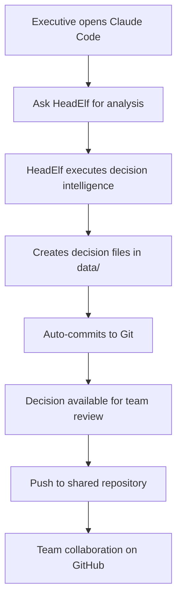
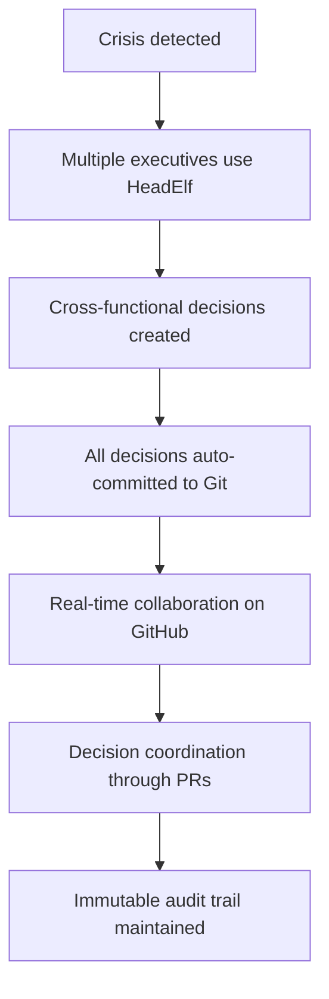
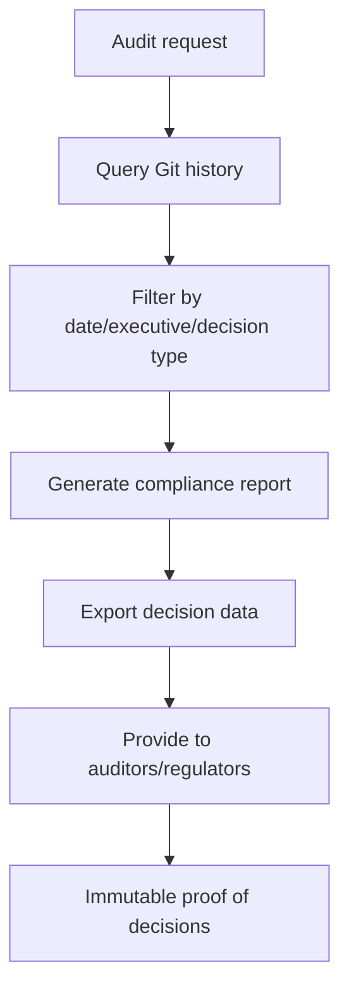

# Git-Based Architecture Guide

## Revolutionary Approach: Why Git Changes Everything

HeadElf pioneered a **Git-first architecture** that fundamentally transforms how executive intelligence systems operate. Instead of complex databases, servers, and custom security systems, HeadElf leverages Git repositories to provide enterprise-grade capabilities with zero infrastructure overhead.

## Core Architecture Principles

### 🏗️ **Local-First, Git-Tracked Operations**

HeadElf operates directly on your local file system, with all executive decisions and data automatically tracked in Git repositories:

```
Your HeadElf Operation:
├── Execute CTO decision → Creates data/decisions/2024-02-26-cto-venture-analysis.json
├── Auto-commits to Git → Immutable audit trail with full history
├── Push to GitHub → Distributed backup + collaboration
└── Leverage GitHub → Security, access control, marketplace
```

### 🔐 **Security Through GitHub Infrastructure**

Instead of building custom security systems, HeadElf leverages GitHub's proven enterprise infrastructure:

- **Authentication**: GitHub OAuth, SSH keys, Personal Access Tokens
- **Authorization**: Repository permissions (read/write/admin) control access
- **Audit Trail**: Git commit history provides immutable audit log
- **Role-Based Access**: GitHub Teams map directly to C-suite roles
- **Enterprise Features**: SAML, LDAP, compliance through GitHub Enterprise

### 🛍️ **Community Through Repository Ecosystem**

Extension marketplace and community features emerge organically through Git workflows:

- **Extension Discovery**: GitHub search with `headelf-extension` topic
- **Peer Review**: Standard GitHub pull request process
- **Distribution**: Simple `git clone` installation model
- **Version Management**: Git tags and GitHub releases
- **Community Governance**: Issues, Discussions, Projects, Wiki

## Two Operational Models

HeadElf supports two distinct operational models based on your relationship to the system:

### 1. **Framework Contributor Model** 🛠️

**For developers enhancing HeadElf itself:**

```bash
# One-time setup
git clone https://github.com/pauljbernard/headElf.git
cd headElf
./install.sh

# Development workflow
git checkout -b feature/cfo-esg-framework
# Make changes to core HeadElf framework
git add . && git commit -m "feat(CFO): Add ESG investment analysis framework"
git push origin feature/cfo-esg-framework
# Submit PR to main HeadElf repository
```

**Use Cases:**
- Adding new C-suite executive capabilities
- Enhancing existing decision frameworks
- Improving architecture and performance
- Contributing to testing and documentation

### 2. **Executive Intelligence User Model** 👔

**For executives using HeadElf for business decisions:**

```bash
# One-time HeadElf installation
curl -sSL https://raw.githubusercontent.com/pauljbernard/headElf/main/install.sh | bash

# Create your executive intelligence repository
mkdir my-executive-intelligence
cd my-executive-intelligence
git init
git remote add origin https://github.com/mycompany/my-executive-intelligence.git

# Use HeadElf (integrates with your Claude Code)
# HeadElf automatically creates decision files and commits them
```

**Use Cases:**
- Making strategic business decisions
- Tracking decision history and outcomes
- Building organizational knowledge base
- Collaborating with executive team

## Git-Based Data Persistence

### Decision Storage Structure

Every executive decision creates structured data files automatically organized by role, date, and type:

```
data/
├── decisions/
│   ├── 2024-02-26-cto-venture-analysis-acme-corp.json
│   ├── 2024-02-27-cfo-ma-financial-model-target-inc.json
│   ├── by-role/
│   │   ├── cto/
│   │   ├── cfo/
│   │   └── ciso/
│   └── by-date/
│       ├── 2024-02-26/
│       └── 2024-02-27/
├── contexts/
│   └── users/
│       ├── ceo-user-context.json
│       └── cto-user-context.json
├── analytics/
│   └── snapshots/
│       └── 2024-02-weekly-analytics.json
└── extensions/
    └── manifest.json
```

### Automatic Git Integration

Every HeadElf decision automatically:

1. **Creates structured data files** in appropriate directories
2. **Commits changes to Git** with descriptive commit messages
3. **Includes metadata** like decision confidence, execution time, stakeholders
4. **Maintains audit trail** through Git's immutable history

Example automatic commit:
```
[HeadElf] CTO decision: venture_capital - Evaluate AI startup investment

CTO Intelligence Analysis:
- Decision Type: venture_capital
- Query: Evaluate TechNova Inc for Series A investment
- Confidence: 0.87
- Execution Time: 1.2s
- Files: 3 decision files created

🤖 Generated with HeadElf Executive Intelligence System
```

## GitHub-Based Security Model

### Authentication Methods

HeadElf leverages GitHub's proven authentication:

```bash
# Option 1: GitHub CLI (Recommended)
gh auth login
# Automatically uses your GitHub credentials

# Option 2: SSH Keys
ssh-keygen -t ed25519 -C "your.email@company.com"
# Add to GitHub account

# Option 3: Personal Access Token
export GITHUB_TOKEN="your-personal-access-token"
```

### Access Control Through Repository Permissions

Repository permissions directly control HeadElf access:

- **Read**: View decisions and analytics, but cannot execute new decisions
- **Write**: Full HeadElf usage - execute decisions, modify contexts
- **Admin**: Manage extensions, configure policies, manage team access

### Enterprise Integration

For enterprise deployments, leverage GitHub Enterprise features:

```yaml
# .github/CODEOWNERS (controls who can approve decisions)
data/decisions/cfo/* @finance-team @cfo-approvers
data/decisions/ciso/* @security-team @ciso-approvers
data/decisions/clo/* @legal-team @clo-approvers

# Branch protection rules
# Require PR approval for certain decision types
# Require status checks for compliance validation
```

### Audit and Compliance

Git commit history provides comprehensive audit trail:

```bash
# View all decisions by specific executive
git log --author="cto@company.com" --oneline

# View decisions for compliance period
git log --since="2024-01-01" --until="2024-03-31" --grep="HeadElf"

# Generate compliance report
git log --since="2024-01-01" --format="%h %cd %s" --date=short > compliance-report.txt
```

## Extension Marketplace Through GitHub

### Extension Discovery

Extensions are discovered through GitHub's native search and topic system:

```bash
# Search for HeadElf extensions
github.com/search?q=topic:headelf-extension

# Industry-specific extensions
github.com/search?q=topic:headelf-extension+topic:financial-services
github.com/search?q=topic:headelf-extension+topic:healthcare
```

### Extension Installation

Simple Git-based installation:

```bash
# Install extension directly
git clone https://github.com/community/headelf-extension-financial-services
cd headelf-extension-financial-services
./install.sh

# Or use HeadElf marketplace
headelf extension install financial-services
```

### Extension Development

Create extensions using standard GitHub workflows:

```bash
# Create extension repository
git init headelf-extension-manufacturing
cd headelf-extension-manufacturing

# Follow HeadElf extension template
mkdir -p skills/manufacturing-operations
echo '# Manufacturing Operations Skill' > skills/manufacturing-operations/skill.md

# Publish extension
git remote add origin https://github.com/yourcompany/headelf-extension-manufacturing
git push origin main

# Register with HeadElf marketplace
# Submit PR to https://github.com/pauljbernard/headElf/marketplace/registry.json
```

## Operational Workflows

### Daily Executive Decision Making



### Crisis Management Workflow



### Compliance and Audit Workflow



## Enterprise Deployment Patterns

### Single Organization Model

```bash
# Organization: AcmeCorp
# Repository: github.com/acmecorp/executive-intelligence
# Team access through GitHub Teams:
# - @acmecorp/c-suite (full access)
# - @acmecorp/board-of-directors (read access)
# - @acmecorp/compliance-team (audit access)
```

### Multi-Division Model

```bash
# Separate repositories per division:
# github.com/globocorp/executive-intelligence-manufacturing
# github.com/globocorp/executive-intelligence-financial-services
# github.com/globocorp/executive-intelligence-technology

# Cross-division coordination through GitHub Organizations
```

### Consultant/Advisory Model

```bash
# Advisory firm repository:
# github.com/advisory-firm/client-executive-intelligence
#
# Client-specific branches:
# - client-acme/executive-decisions
# - client-beta/executive-decisions
#
# Privacy maintained through branch permissions
```

## Benefits of Git-Based Architecture

### ✅ **Zero Infrastructure Overhead**
- No databases to maintain
- No servers to manage
- No complex deployment pipelines
- No custom security systems

### ✅ **Enterprise-Grade Security**
- GitHub's proven security model
- SAML/LDAP integration available
- Multi-factor authentication
- Advanced threat protection

### ✅ **Immutable Audit Trail**
- Every decision permanently recorded
- Complete history with timestamps
- Distributed backup across Git clones
- Cryptographic integrity through Git hashes

### ✅ **Natural Collaboration**
- Standard GitHub workflows
- Pull request review process
- Issues and discussion integration
- Project management tools

### ✅ **Community-Driven Extensions**
- Organic marketplace through GitHub
- Peer review through pull requests
- Version control through Git tags
- Discovery through GitHub search

### ✅ **Regulatory Compliance**
- Complete audit trail
- Immutable decision history
- Access control documentation
- Standard compliance reporting

## Best Practices

### Repository Organization

```bash
# Recommended repository structure for executive teams:
my-executive-intelligence/
├── README.md                    # Executive dashboard and summary
├── data/                        # HeadElf auto-generated data
├── policies/                    # Decision-making policies
├── templates/                   # Decision templates
├── reports/                     # Generated reports
└── .github/
    ├── CODEOWNERS              # Approval matrix
    ├── workflows/              # Automated compliance checks
    └── ISSUE_TEMPLATE/         # Decision request templates
```

### Security Configuration

```bash
# Enable branch protection for sensitive decisions
gh api repos/yourorg/executive-intelligence/branches/main/protection \
  --method PUT \
  --field required_status_checks='{"strict":true,"contexts":["compliance-check"]}' \
  --field enforce_admins=true \
  --field required_pull_request_reviews='{"required_approving_review_count":2}'
```

### Privacy Considerations

```bash
# Use separate repositories for sensitive data
github.com/yourorg/executive-intelligence-public    # General decisions
github.com/yourorg/executive-intelligence-private   # Sensitive decisions

# Configure appropriate .gitignore
echo "data/sensitive/" >> .gitignore
echo "*.confidential" >> .gitignore
```

## Migration from Traditional Systems

### From Database-Based Systems

1. **Export existing decisions** to JSON format
2. **Import into HeadElf data structure**
3. **Create initial Git commit** with historical data
4. **Train executives** on Git-based workflows
5. **Gradually transition** decision-making to HeadElf

### From Document-Based Systems

1. **Convert documents** to structured HeadElf format
2. **Organize by decision type and date**
3. **Create Git repository** with historical decisions
4. **Implement HeadElf** for new decisions
5. **Link old and new** through cross-references

## Support and Resources

### Documentation
- [Installation Guide](./getting-started)
- [User Guide](./user-guide)
- [Developer Guide](./developer-guide)
- [API Reference](./api-reference)

### Community
- [GitHub Issues](https://github.com/pauljbernard/headElf/issues) - Bug reports and feature requests
- [GitHub Discussions](https://github.com/pauljbernard/headElf/discussions) - Community discussion
- [GitHub Wiki](https://github.com/pauljbernard/headElf/wiki) - Community documentation

### Enterprise Support
For enterprise deployments requiring custom integration, compliance certification, or dedicated support, contact enterprise support through GitHub Issues with the `enterprise-support` label.

---

The Git-based architecture represents a paradigm shift in executive intelligence systems, providing enterprise-grade capabilities through proven infrastructure rather than custom implementations. This approach ensures reliability, security, and scalability while maintaining simplicity and transparency.