HeadElf leverages Claude Code's **Model Context Protocol (MCP)** to connect with any enterprise system, eliminating the need for custom integrations. This guide explains how to configure and use MCP servers to integrate HeadElf with real-world business systems.

## MCP Architecture Overview

### What is Model Context Protocol (MCP)?

MCP is Claude Code's standardized protocol for connecting to external systems and data sources. Rather than building custom integrations, HeadElf inherits all of Claude Code's MCP capabilities, enabling seamless connectivity to any system with an MCP server.

```mermaid
graph TB
    HeadElf[🤖 HeadElf Executive Intelligence]
    ClaudeCode[📋 Claude Code Platform]
    MCP[🔌 Model Context Protocol]

    subgraph Enterprise Systems [🏢 Enterprise Systems]
        ERP[📊 ERP Systems<br/>SAP, Oracle, NetSuite]
        CRM[👥 CRM Systems<br/>Salesforce, HubSpot, Dynamics]
        Financial[💰 Financial Systems<br/>QuickBooks, Sage, Workday]
        HRIS[👤 HRIS Systems<br/>BambooHR, ADP, SuccessFactors]
        BI[📈 BI/Analytics<br/>Tableau, PowerBI, Looker]
        Custom[⚙️ Custom Applications<br/>APIs, Databases, Services]
    end

    subgraph MCP Servers [🔧 MCP Server Ecosystem]
        ERPServer[ERP MCP Server]
        CRMServer[CRM MCP Server]
        FinancialServer[Financial MCP Server]
        HRISServer[HRIS MCP Server]
        BIServer[BI MCP Server]
        CustomServer[Custom MCP Server]
    end

    HeadElf --> ClaudeCode
    ClaudeCode --> MCP
    MCP --> ERPServer --> ERP
    MCP --> CRMServer --> CRM
    MCP --> FinancialServer --> Financial
    MCP --> HRISServer --> HRIS
    MCP --> BIServer --> BI
    MCP --> CustomServer --> Custom
```



### MCP Benefits for Executive Intelligence

**🔄 Universal Connectivity**: Connect to any system through standardized MCP servers
**🔒 Enterprise Security**: OAuth, API keys, and enterprise authentication supported
**⚡ Real-time Data**: Live data access for current business intelligence
**🎯 Executive Context**: Business system data enhances executive decision-making
**📊 Cross-functional Analysis**: Integrated data from multiple systems for comprehensive analysis

## Enterprise System Integration

### ERP System Integration

**Supported ERP Systems via MCP:**
- SAP (SAP MCP Server)
- Oracle ERP Cloud (Oracle MCP Server)
- NetSuite (NetSuite MCP Server)
- Microsoft Dynamics (Dynamics MCP Server)
- Workday (Workday MCP Server)

**Configuration Example - SAP Integration:**

```json
// .claude_config.json
{
  "mcpServers": {
    "sap-erp": {
      "command": "npx",
      "args": ["@sap/mcp-server"],
      "env": {
        "SAP_CLIENT": "100",
        "SAP_HOST": "sap-prod.company.com",
        "SAP_USERNAME": "HEADELF_USER",
        "SAP_PASSWORD_FILE": "/secure/sap-credentials"
      }
    }
  }
}
```

**HeudElf Usage with ERP Data:**
```
> "Use cfo-intelligence with current ERP data: Analyze Q4 financial performance including revenue, costs, cash flow, and profitability by business unit and geography"

CFO Intelligence with SAP ERP Integration:
✅ Revenue Analysis: $2.1B Q4 revenue (+12% YoY)
✅ Cost Structure: 68% COGS, 22% OpEx, 10% EBITDA margin
✅ Cash Flow: $180M operating cash flow, $45M free cash flow
✅ Business Unit Performance: Enterprise +15%, SMB +8%, International +18%
✅ Geographic Analysis: Americas $1.2B, EMEA $650M, APAC $250M
```

### CRM System Integration

**Supported CRM Systems via MCP:**
- Salesforce (Salesforce MCP Server)
- HubSpot (HubSpot MCP Server)
- Microsoft Dynamics CRM (Dynamics MCP Server)
- Pipedrive (Pipedrive MCP Server)

**Configuration Example - Salesforce Integration:**

```json
// .claude_config.json
{
  "mcpServers": {
    "salesforce-crm": {
      "command": "npx",
      "args": ["@salesforce/mcp-server"],
      "env": {
        "SALESFORCE_LOGIN_URL": "https://company.my.salesforce.com",
        "SALESFORCE_USERNAME": "headelf@company.com",
        "SALESFORCE_SECURITY_TOKEN_FILE": "/secure/sf-token",
        "SALESFORCE_CLIENT_ID": "your-connected-app-client-id"
      }
    }
  }
}
```

**HeudElf Usage with CRM Data:**
```
> "Use cmso-intelligence with Salesforce data: Analyze sales pipeline, customer acquisition trends, and revenue forecasting for strategic planning"

CMSO Intelligence with Salesforce Integration:
✅ Pipeline Analysis: $15M qualified pipeline, 68% close probability
✅ Customer Acquisition: 145 new customers Q4 (+22% vs Q3)
✅ Revenue Forecasting: $18.2M Q1 forecast (confidence: 85%)
✅ Sales Team Performance: Top performers, quota attainment, activity metrics
✅ Customer Segmentation: Enterprise 45%, Mid-market 35%, SMB 20%
```

### Financial Systems Integration

**Supported Financial Systems:**
- QuickBooks (QuickBooks MCP Server)
- Sage Intacct (Sage MCP Server)
- Xero (Xero MCP Server)
- NetSuite ERP (NetSuite MCP Server)

**Configuration Example - QuickBooks Integration:**

```json
// .claude_config.json
{
  "mcpServers": {
    "quickbooks": {
      "command": "npx",
      "args": ["@intuit/quickbooks-mcp-server"],
      "env": {
        "QB_CLIENT_ID": "your-quickbooks-app-id",
        "QB_CLIENT_SECRET_FILE": "/secure/qb-secret",
        "QB_SANDBOX": "false",
        "QB_COMPANY_ID": "your-company-id"
      }
    }
  }
}
```

### HRIS Integration

**Supported HRIS Systems:**
- BambooHR (BambooHR MCP Server)
- Workday (Workday MCP Server)
- ADP (ADP MCP Server)
- SuccessFactors (SuccessFactors MCP Server)

**Configuration Example - BambooHR Integration:**

```json
// .claude_config.json
{
  "mcpServers": {
    "bamboohr": {
      "command": "npx",
      "args": ["@bamboohr/mcp-server"],
      "env": {
        "BAMBOOHR_SUBDOMAIN": "yourcompany",
        "BAMBOOHR_API_KEY_FILE": "/secure/bamboo-api-key"
      }
    }
  }
}
```

**HeudElf Usage with HRIS Data:**
```
> "Use chro-intelligence with BambooHR data: Analyze workforce metrics, performance trends, and develop talent strategy recommendations"

CHRO Intelligence with BambooHR Integration:
✅ Workforce Analytics: 1,247 employees, 8.5% voluntary turnover
✅ Performance Trends: 87% meet/exceed expectations, 13% improvement needed
✅ Diversity Metrics: 42% diverse representation, 38% leadership diversity
✅ Talent Pipeline: 156 open positions, 23 avg days to fill
✅ Engagement Scores: 4.2/5.0 overall satisfaction, 89% retention intent
```

## Advanced Integration Patterns

### Multi-System Cross-Functional Analysis

**Comprehensive Business Intelligence:**
```
> "Coordinate across all integrated systems: Analyze business performance including financial results (ERP), sales pipeline (CRM), workforce productivity (HRIS), and customer satisfaction (Support) for comprehensive Q4 board report"

Cross-Functional Executive Analysis:
📊 Financial Performance (ERP): $2.1B revenue, 10% EBITDA margin
📈 Sales Performance (CRM): $15M pipeline, 68% close rate
👥 Workforce Metrics (HRIS): 1,247 employees, 4.2/5.0 engagement
🎯 Customer Success (Support): 92% CSAT, 18-hour avg response time

Strategic Insights:
• Revenue growth driven by enterprise segment expansion
• Sales pipeline healthy for Q1 targets achievement
• Workforce engagement stable with retention focus needed
• Customer satisfaction excellent, operational efficiency opportunity
```

### Real-time Executive Dashboards

**Dynamic Data Integration:**
```
> "Create real-time executive dashboard using current data from ERP (financials), CRM (sales), and HRIS (people) for daily executive briefing"

Live Executive Dashboard Generated:
┌─ FINANCIAL METRICS (ERP) ──────────────────┐
│ • Daily Revenue: $8.2M (+5% vs yesterday)  │
│ • Cash Position: $45M (-$1.2M vs week)     │
│ • A/R Outstanding: $12.3M (32 days DSO)    │
└─────────────────────────────────────────────┘

┌─ SALES METRICS (CRM) ─────────────────────┐
│ • Pipeline Value: $15.2M (+$800K today)   │
│ • Deals Closing: 8 deals this week        │
│ • New Leads: 23 qualified leads today     │
└────────────────────────────────────────────┘

┌─ PEOPLE METRICS (HRIS) ────────────────────┐
│ • Active Employees: 1,247 total          │
│ • New Hires This Week: 3 employees       │
│ • Open Positions: 156 roles              │
└────────────────────────────────────────────┘
```

## Security and Compliance

### Enterprise Authentication

**OAuth 2.0 Integration:**
```json
// Secure OAuth configuration
{
  "mcpServers": {
    "enterprise-system": {
      "command": "npx",
      "args": ["@company/enterprise-mcp-server"],
      "env": {
        "OAUTH_CLIENT_ID": "your-oauth-client-id",
        "OAUTH_CLIENT_SECRET_FILE": "/secure/oauth-secret",
        "OAUTH_REDIRECT_URI": "http://localhost:3000/callback",
        "OAUTH_SCOPE": "read:financial write:reports"
      }
    }
  }
}
```

**API Key Management:**
```json
// Secure API key configuration
{
  "mcpServers": {
    "financial-system": {
      "command": "npx",
      "args": ["@company/financial-mcp-server"],
      "env": {
        "API_KEY_FILE": "/secure/api-keys/financial-system.key",
        "API_BASE_URL": "https://api-prod.company.com/v2",
        "REQUEST_TIMEOUT": "30000"
      }
    }
  }
}
```

### Data Governance

**Data Access Controls:**
- **Role-based Access**: MCP servers enforce enterprise role permissions
- **Data Filtering**: Systems return only authorized data based on user context
- **Audit Logging**: All data access logged for compliance and security
- **Rate Limiting**: API rate limits prevent system overload

**Privacy Protection:**
- **Data Minimization**: Only request necessary data for executive analysis
- **PII Handling**: Automatic PII detection and masking in responses
- **Retention Policies**: Temporary data caching with automatic expiration
- **Encryption**: All data transmission encrypted via HTTPS/TLS

## Implementation Guide

### Step 1: MCP Server Selection

**Available MCP Servers:**
- **Official Servers**: Maintained by system vendors (Salesforce, SAP, etc.)
- **Community Servers**: Open-source community-maintained servers
- **Custom Servers**: Company-specific servers for proprietary systems

**Server Discovery:**
```bash
# Search for available MCP servers
npm search mcp-server salesforce
npm search mcp-server sap
npm search mcp-server quickbooks

# Install MCP servers
npm install -g @salesforce/mcp-server
npm install -g @sap/mcp-server
npm install -g @quickbooks/mcp-server
```

### Step 2: Configuration Setup

**Claude Code Configuration:**
```json
// ~/.claude/config.json
{
  "mcpServers": {
    "production-erp": {
      "command": "npx",
      "args": ["@sap/mcp-server"],
      "env": {
        "SAP_CLIENT": "100",
        "SAP_HOST": "erp-prod.company.com",
        "SAP_CREDENTIALS_FILE": "/secure/sap-prod-creds"
      }
    },
    "production-crm": {
      "command": "npx",
      "args": ["@salesforce/mcp-server"],
      "env": {
        "SF_LOGIN_URL": "https://company.my.salesforce.com",
        "SF_CREDENTIALS_FILE": "/secure/sf-prod-creds"
      }
    }
  }
}
```

### Step 3: Security Configuration

**Credential Management:**
```bash
# Create secure credential files
echo "username:password" > /secure/sap-prod-creds
echo "oauth_token:refresh_token" > /secure/sf-prod-creds

# Set appropriate permissions
chmod 600 /secure/*-creds
chown headelf-user /secure/*-creds
```

**Network Security:**
```json
// Network configuration
{
  "mcpServers": {
    "enterprise-system": {
      "env": {
        "PROXY_HOST": "corporate-proxy.company.com",
        "PROXY_PORT": "8080",
        "SSL_VERIFY": "true",
        "TIMEOUT": "60000"
      }
    }
  }
}
```

### Step 4: Testing and Validation

**Connection Testing:**
```
> "Test connection to ERP system: retrieve basic system information and verify data access"

MCP Connection Test Results:
✅ SAP ERP Connection: Successful
✅ Authentication: Valid credentials
✅ Data Access: Read permissions verified
✅ API Response: 1.2s average response time
✅ System Status: Operational, 99.8% uptime
```

**Data Quality Validation:**
```
> "Validate data consistency between ERP and CRM systems for customer and revenue data"

Data Consistency Validation:
✅ Customer Records: 1,247 customers match between systems
⚠️  Revenue Data: Minor timing differences (ERP updated hourly, CRM real-time)
✅ Data Quality: 99.2% consistency score
📋 Recommendations: Implement real-time ERP sync for revenue data
```

## Executive Use Cases

### CFO: Financial Analysis with ERP Integration

**Comprehensive Financial Intelligence:**
```
> "Use cfo-intelligence with real-time ERP data: Analyze cash flow, profitability, and financial health for board presentation"

CFO Analysis with Live ERP Data:
🔍 Cash Flow Analysis:
• Operating Cash Flow: $12.3M (current month)
• Free Cash Flow: $8.9M after CapEx
• Cash Burn Rate: $2.1M/month operational
• Cash Runway: 18+ months at current burn

📊 Profitability Metrics:
• Gross Margin: 72% (industry benchmark: 68%)
• EBITDA Margin: 15% (target: 18% by Q2)
• Net Margin: 8% (improvement vs 6% last year)
• ROI: 22% (exceeds 15% target)

💡 Strategic Recommendations:
• Accelerate collections to improve DSO from 42 to 35 days
• Optimize operational expenses for 3-point EBITDA improvement
• Consider debt refinancing to reduce interest expense
```

### COO: Supply Chain Integration

**Operational Excellence with Real-time Data:**
```
> "Use coo-intelligence with ERP and supplier portal data: Analyze supply chain performance, identify bottlenecks, and optimize operations"

COO Analysis with Supply Chain Data:
📦 Supply Chain Performance:
• On-time Delivery: 92% (target: 95%)
• Inventory Turns: 8.2x annually
• Supplier Performance: 23 suppliers >95% quality
• Backorder Rate: 3.2% (down from 4.8% last quarter)

⚡ Bottleneck Analysis:
• Critical Path: Semiconductor components (12-week lead time)
• Capacity Constraints: Assembly line #3 at 98% utilization
• Transportation: 15% cost increase due to fuel prices
• Quality Issues: Supplier XYZ 89% quality (below 95% standard)

🎯 Optimization Opportunities:
• Dual-source semiconductor suppliers to reduce risk
• Add second shift to assembly line #3 for 40% capacity increase
• Negotiate fuel surcharge caps with logistics partners
• Implement quality improvement plan with Supplier XYZ
```

### CMSO: Customer Intelligence Integration

**Marketing and Sales Optimization:**
```
> "Use cmso-intelligence with CRM and marketing automation data: Analyze customer acquisition, retention, and lifetime value for strategic planning"

CMSO Analysis with Customer Data:
👥 Customer Acquisition Metrics:
• New Customers: 156 this quarter (+18% YoY)
• Acquisition Cost (CAC): $2,400 (target: $2,000)
• Conversion Rate: 12% (lead to customer)
• Top Channels: Digital marketing (45%), referrals (32%), direct (23%)

💰 Customer Lifetime Value:
• Average LTV: $28,500 (3.2 years retention)
• LTV/CAC Ratio: 11.9x (healthy >3x ratio)
• Retention Rate: 87% annual retention
• Expansion Revenue: 23% of existing customers expanded

🚀 Strategic Initiatives:
• Focus digital marketing budget on high-converting channels
• Implement referral incentive program to boost 32% referral rate
• Develop customer success program to improve 87% retention to 90%
• Create upselling playbooks to increase 23% expansion rate to 30%
```

## Troubleshooting and Support

### Common Configuration Issues

**Connection Problems:**
```
Error: MCP server connection failed
Solution: Verify network connectivity, proxy settings, and firewall rules

Error: Authentication failed
Solution: Check credentials, refresh tokens, and API key validity

Error: Permission denied
Solution: Verify user permissions and API scope configuration
```

**Performance Optimization:**
- **Connection Pooling**: Configure MCP servers for connection reuse
- **Caching**: Implement appropriate data caching strategies
- **Rate Limiting**: Configure respectful API request rates
- **Monitoring**: Set up MCP server health monitoring

### Enterprise Support

**Production Deployment:**
- **High Availability**: Configure redundant MCP servers
- **Load Balancing**: Distribute requests across server instances
- **Monitoring**: Implement comprehensive logging and alerting
- **Backup**: Configure failover and disaster recovery

**Security Hardening:**
- **Network Isolation**: Deploy MCP servers in secure network segments
- **Certificate Management**: Use proper SSL/TLS certificates
- **Access Logging**: Comprehensive audit trail for all system access
- **Penetration Testing**: Regular security assessment of integrations

## Best Practices

### Architecture Recommendations

**🏗️ Design Principles:**
- **Modularity**: Use separate MCP servers for each system type
- **Security**: Never embed credentials in configuration files
- **Performance**: Cache appropriate data with TTL policies
- **Monitoring**: Implement comprehensive logging and alerting

**🔧 Operational Excellence:**
- **Documentation**: Maintain comprehensive integration documentation
- **Testing**: Regular integration testing and data validation
- **Maintenance**: Keep MCP servers and dependencies updated
- **Support**: Establish clear escalation procedures for integration issues

### Integration Strategy

**📋 Phased Implementation:**
1. **Phase 1**: Start with read-only integrations for reporting
2. **Phase 2**: Add real-time data access for dynamic analysis
3. **Phase 3**: Implement write capabilities for workflow automation
4. **Phase 4**: Full bi-directional integration with workflow orchestration

**🎯 Success Metrics:**
- **Data Accuracy**: >99% consistency between systems
- **Performance**: <3 second response time for data queries
- **Availability**: >99.5% uptime for critical integrations
- **User Adoption**: Executive usage metrics and satisfaction scores

---

## Conclusion

HeudElf's integration with enterprise systems is **not a gap** - it's a **powerful existing capability** through Claude Code's MCP architecture. This approach provides:

✅ **Universal Connectivity**: Connect to any system with available MCP servers
✅ **Enterprise Security**: Leverage existing authentication and authorization systems
✅ **Real-time Intelligence**: Access live business data for current decision-making
✅ **Scalable Architecture**: Add new integrations without custom development
✅ **Minimal Maintenance**: MCP servers maintained by system vendors and community

The key is **proper configuration and documentation** - not building custom integrations. This guide provides the comprehensive framework for connecting HeudElf to your entire enterprise technology ecosystem through proven, secure, and maintainable MCP integrations.